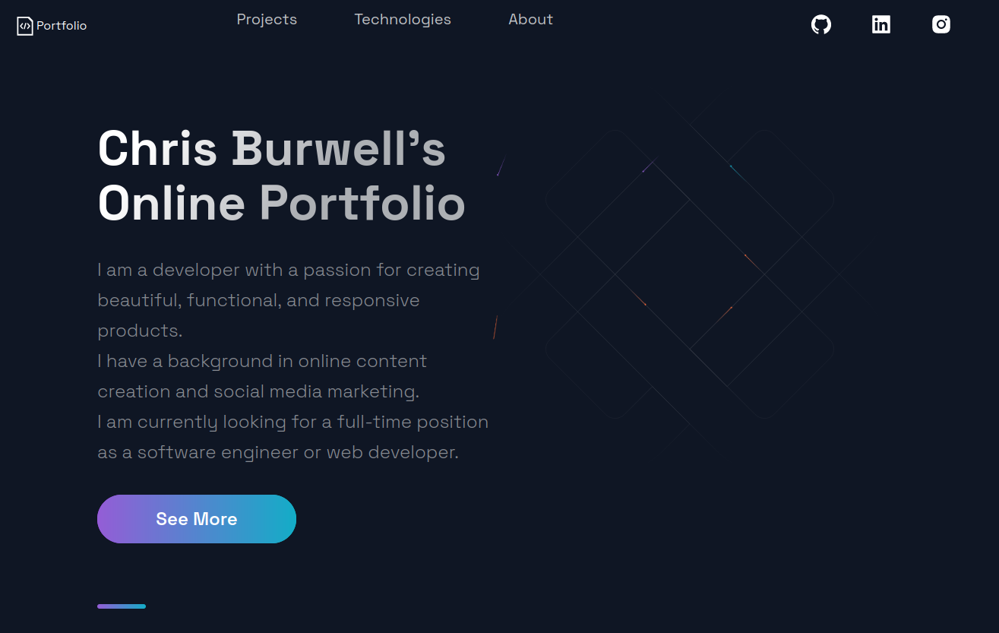

 

  

  <h3 align="center">Chris Burwell's Portfolio</h3>

  

    Software Engineer / Fullstack Developer 
     
     
    <a href="https://github.com/countchrisdo/portfolio"><strong>Explore »</strong></a>
     
     
    <a href="https://github.com/countchrisdo/portfolio">View Demo</a>
    .
    <a href="https://github.com/countchrisdo/portfolio/issues">Report Bug</a>
    .
    <a href="https://github.com/countchrisdo/portfolio/issues">Request Feature</a>
  

 

## Table Of Contents

* [About the Project](#about-the-project)
* [Built With](#built-with)
* [Acknowledgements](#acknowledgements)

## About The Project

A SPA built with React & Next.js and deployed to Hostinger to showcase my developer story, projects and skills.

## Built With

- HTML
- CSS
- JavaScript
- React

## Planned Features

- [ ] Use GitHub API to automatically fetch my information
- [ ] Create custom Favicon
- [ ] Create custom 404 page
- [ ] View up-to-date resume on site more easily

## Acknowledgements

* [Javascript Mastery](https://javascriptmastery.eo.page/)

